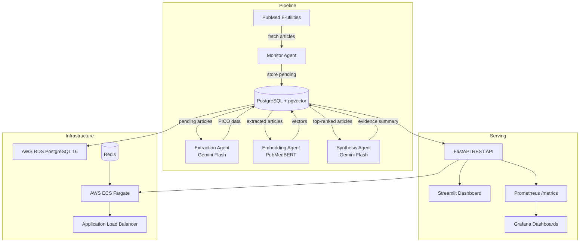

# MedLit Agent

A multi-agent system that continuously monitors PubMed, extracts structured PICO data using LLMs, generates semantic embeddings, and synthesises evidence summaries for healthcare researchers and clinicians.

## Architecture



## Key Capabilities

- Automated PubMed monitoring for configurable clinical queries (cron-based)
- PICO extraction (Population, Intervention, Comparison, Outcome) via Gemini Flash
- Evidence level grading (Level I–V) based on study design
- PubMedBERT semantic embeddings stored in pgvector
- Hybrid search: `0.7 × cosine_similarity + 0.3 × ts_rank`
- Evidence synthesis with grade (strong/moderate/weak/insufficient) and consensus analysis
- Streamlit dashboard with query management, article explorer, semantic search, and synthesis viewer
- Prometheus metrics + Grafana dashboards for pipeline observability
- Structured JSON logging with correlation IDs across all services

## Tech Stack

| Layer | Technology |
|---|---|
| API | FastAPI + SQLAlchemy 2.0 async |
| Database | PostgreSQL 16 + pgvector |
| LLM | Google Gemini Flash (`google-genai`) |
| Embeddings | PubMedBERT via `sentence-transformers` |
| Scheduling | APScheduler |
| Observability | structlog + Prometheus + Grafana |
| Dashboard | Streamlit |
| IaC | Terraform (AWS ECS Fargate + RDS + ElastiCache) |
| CI/CD | GitHub Actions |

## Quickstart (Docker Compose)

### Prerequisites
- Docker + Docker Compose
- Google Gemini API key

### 1. Clone and configure

```bash
git clone <repo-url> medlit_agent
cd medlit_agent
cp .env.example .env
# Edit .env — set GEMINI_API_KEY and DATABASE_URL
```

### 2. Start the stack

```bash
docker compose up --build -d
docker compose exec app alembic upgrade head
```

### 3. Verify

```bash
curl http://localhost:8000/v1/health
# → {"status": "ok"}
```

### 4. Create a clinical query and run the pipeline

```bash
# Create a query
curl -X POST http://localhost:8000/v1/queries \
  -H "Content-Type: application/json" \
  -d '{"name": "SGLT2 Heart Failure", "pubmed_query": "SGLT2 inhibitors heart failure", "is_active": true}'

# Run the full pipeline (replace <query-id> with the id from above)
curl -X POST http://localhost:8000/v1/pipeline/run \
  -H "Content-Type: application/json" \
  -d '{"query_id": "<query-id>"}'
```

### 5. Open the dashboard

```
http://localhost:8000/docs   # Swagger UI
```

## Production Stack (with Monitoring)

```bash
docker compose -f docker-compose.prod.yml up -d
docker compose -f docker-compose.prod.yml exec app alembic upgrade head
```

| Service | URL |
|---|---|
| FastAPI | http://localhost:8000 |
| Streamlit Dashboard | http://localhost:8501 |
| Prometheus | http://localhost:9090 |
| Grafana | http://localhost:3000 |

## API Overview

### Pipeline

| Method | Endpoint | Description |
|---|---|---|
| POST | `/v1/pipeline/trigger` | Fetch new PubMed articles for a query |
| POST | `/v1/pipeline/extract` | Run PICO extraction on pending articles |
| POST | `/v1/pipeline/embed` | Generate PubMedBERT embeddings |
| POST | `/v1/pipeline/synthesize` | Generate evidence synthesis for a query |
| POST | `/v1/pipeline/run` | Full pipeline (all 4 stages) |
| GET | `/v1/pipeline/runs` | List pipeline run history |

### Articles & Search

| Method | Endpoint | Description |
|---|---|---|
| GET | `/v1/articles` | List articles with filters |
| POST | `/v1/articles/search` | Hybrid semantic + full-text search |

### Syntheses

| Method | Endpoint | Description |
|---|---|---|
| GET | `/v1/syntheses` | List evidence syntheses |
| GET | `/v1/syntheses/{id}` | Get a single synthesis |

### Queries

| Method | Endpoint | Description |
|---|---|---|
| GET | `/v1/queries` | List clinical queries |
| POST | `/v1/queries` | Create a clinical query |
| PATCH | `/v1/queries/{id}` | Update a clinical query |
| DELETE | `/v1/queries/{id}` | Delete a clinical query |

## Development

```bash
# Install dependencies
uv pip install --system -e ".[dev]"
uv pip install --system torch --index-url https://download.pytorch.org/whl/cpu

# Run locally (needs PostgreSQL + Redis running)
uvicorn main:app --reload

# Run Streamlit dashboard
streamlit run dashboard/app.py

# Run tests
pytest

# Lint
ruff check .

# Database migrations
alembic upgrade head
alembic revision --autogenerate -m "description"
```

## Cloud Deployment (AWS)

### Prerequisites
- Terraform >= 1.6
- AWS CLI configured
- S3 bucket `medlit-terraform-state` and DynamoDB table `medlit-terraform-locks` created for remote state

### Deploy

```bash
cd terraform
terraform init
terraform plan -var="db_password=<secret>" -var="gemini_api_key=<key>"
terraform apply
```

### CI/CD (GitHub Actions)

Configure these repository secrets:

| Secret | Description |
|---|---|
| `AWS_DEPLOY_ROLE_ARN` | IAM role ARN for OIDC authentication |
| `ECR_REPOSITORY` | ECR repository name |
| `ECS_TASK_FAMILY` | ECS task definition family name |
| `ECS_SERVICE_NAME` | ECS service name |
| `ECS_CLUSTER_NAME` | ECS cluster name |

Workflows:
- **ci.yml** — runs lint + tests on every PR
- **build.yml** — builds and pushes Docker image to ECR on merge to `main`
- **deploy.yml** — deploys to ECS on GitHub release publication

## Environment Variables

See [.env.example](.env.example) for all configuration options.
